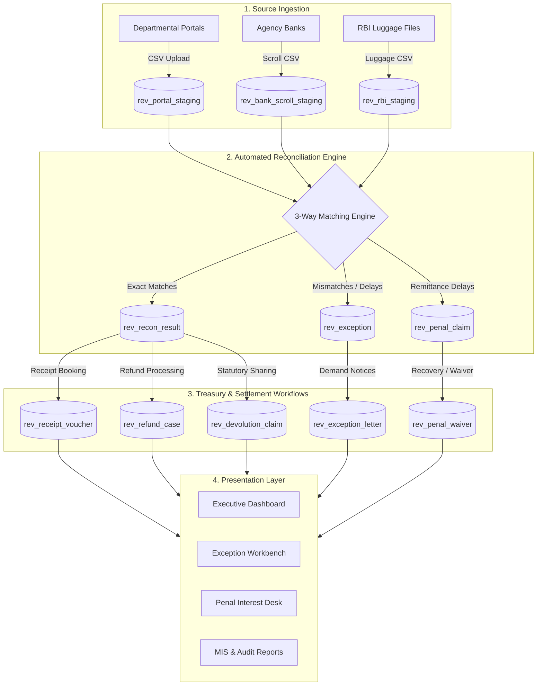

# IFMS State Revenue Collection & Automated 3-Way Reconciliation System

> **Integrated Financial Management System (IFMS) — Revenue & Reconciliation Module**  
> An enterprise-grade, end-to-end State Government Revenue Collection, Automated 3-Way Reconciliation, Exceptions Investigation, Penal Interest Recovery, and Accounting platform.

---

## 🏛️ Overview

The **IFMS Revenue Module** provides state treasury administrations, pay & accounts offices (PAOs), and revenue-collecting departments (Trade & Taxes, State Excise, Transport, Stamps & Registration) with a centralized platform for:
1. **Source Data Ingestion & Staging**: Bulk upload and parsing of Departmental Portals, Agency Bank Scrolls, and RBI Luggage files.
2. **Automated 3-Way Reconciliation**: High-performance multi-pass matching across Portal $\leftrightarrow$ Agency Bank $\leftrightarrow$ RBI settlements.
3. **Exceptions & Dispute Investigation**: Tracking of unremitted collections, amount mismatches, duplicate scrolls, and unmapped remittances with SLA due dates and official demand notices.
4. **Bank SLA & Penal Interest Management**: Statutory simple daily interest calculation ($12\%$ p.a.) on delayed remittances with recovery and sanction waiver approval workflows.
5. **Refund Management**: End-to-end Maker-Checker approval pipeline with Treasury thresholds and automated voucher creation.
6. **Revenue Devolution**: Statutory sharing and allocation to Local Bodies (Panchayats, Municipal Corporations).
7. **Accounting & Receipt Booking**: Automated receipt voucher creation with Treasury Major/Minor Heads (8658 Suspense, 0028/0030/0039/0040 Revenue).
8. **12-Point Automated Demo Test Suite**: Full self-verification suite testing reconciliation integrity, RBAC permissions, and accounting balancing.

---

## 🏗️ Architecture & Tech Stack

### Architecture


### Technology Stack
- **Frontend**: React 18, TypeScript, Vite, Tailwind CSS, Custom SVG Data Visualizations, Context API
- **Backend**: FastAPI, Python 3.11+, SQLAlchemy 2.0 (Asyncio), Pydantic v2, Uvicorn, asyncpg
- **Database**: PostgreSQL 14+ / 17 (`ifms_budget` schema)
- **Security & RBAC**: Role-based access control supporting 9 administrative roles (`SYSADMIN`, `TRE_ADMIN`, `PAO_MAKER`, `PAO_CHECK`, `DDO`, `FINANCE`, `BANK_OPS`, `AUDITOR`, `CITIZEN`)

---

## 🚀 Getting Started

### Prerequisites
- **Node.js** 18+ and **npm** 9+
- **Python** 3.11+
- **PostgreSQL** 14+ (or PostgreSQL 17)

---

### 1. Database Setup
1. Create a PostgreSQL database named `ifms_budget`:
   ```sql
   CREATE DATABASE ifms_budget;
   ```
2. Execute the database initialization scripts located in the root directory:
   ```bash
   psql -U postgres -d ifms_budget -f ifms_budget_revenue_module_objects.sql
   psql -U postgres -d ifms_budget -f alter_revenue_tables_and_vouchers.sql
   ```

---

### 2. Backend Setup
1. Open a terminal in the project root:
   ```bash
   python -m venv .venv
   # Windows:
   .venv\Scripts\activate
   # Linux/macOS:
   source .venv/bin/activate
   ```
2. Install Python dependencies:
   ```bash
   pip install -r requirements.txt
   ```
3. Configure environment variables by copying `.env.example`:
   ```bash
   cp .env.example .env
   ```
4. Start the FastAPI backend server:
   ```bash
   cd backend
   uvicorn app.main:app --reload --host 127.0.0.1 --port 8000
   ```
   • API Swagger Docs will be live at: [http://127.0.0.1:8000/docs](http://127.0.0.1:8000/docs)

---

### 3. Frontend Setup
1. Open a second terminal and navigate to the `frontend/` directory:
   ```bash
   cd frontend
   npm install
   ```
2. Start the Vite development server:
   ```bash
   npm run dev
   ```
3. Open your browser and navigate to:
   ```
   http://127.0.0.1:5173/
   ```

---

## 👥 Supported Roles & Permissions (RBAC)

| Role Code | Role Title | Key Capabilities |
| :--- | :--- | :--- |
| `SYSADMIN` | System Administrator | Full access: configuration, batch operations, test suite execution, master management. |
| `TRE_ADMIN` | Treasury Administrator | Oversight of state collections, exception escalation, penal interest enforcement. |
| `PAO_MAKER` | PAO Maker (Entry Officer) | Uploading files, initiating manual receipts, preparing refund proposals. |
| `PAO_CHECK` | PAO Checker (Verifying Officer) | Approving reconciliations, sanctioning refunds, approving penal waivers. |
| `DDO` | Drawing & Disbursing Officer | Departmental portal monitoring and challan verification. |
| `FINANCE` | Finance Department Official | MIS revenue analytics, devolution tracking, fiscal reports. |
| `BANK_OPS` | Agency Bank Operations | Viewing scroll status, recording remittance responses and UTRs. |
| `AUDITOR` | CAG / State Auditor | Read-only audit trail and compliance verification. |
| `CITIZEN` | Citizen / Taxpayer Portal | Public challan status check and payment verification. |

---

## 🧪 12-Point Automated Demo Test Suite

The system includes a 12-point automated verification engine accessible from the **Help & Demo Tests** screen or via API:
1. Three-way reconciliation exact match test
2. Portal-missing remittance identification
3. Bank-scroll unremitted amount detection
4. Statutory 12% penal interest formula test
5. Treasury major head double-entry balancing
6. Maker-Checker refund authorization limit test
7. Local body devolution computation test
8. Role-based RBAC endpoint protection test
9. Staging idempotency & duplicate batch rejection
10. Audit trail tamper-proof logging verification
11. Multi-financial year switching test
12. End-to-end receipt voucher posting test

---

## 📄 License & Ownership
This project is developed for State Government Integrated Financial Management Systems (IFMS). All rights reserved.
